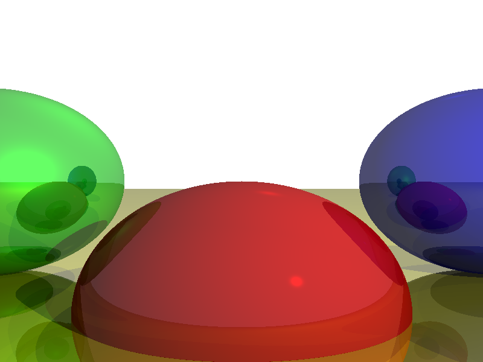

# Ray Tracer in Python

This project is a simple ray tracer implemented in Python. It demonstrates the basics of ray tracing, including ray-sphere intersection, lighting, shadows, and reflections. The ray tracer generates an image of a scene containing spheres with different materials and lighting.

## Table of Contents

- [Features](#features)
- [Requirements](#requirements)
- [Installation](#installation)
- [Usage](#usage)
- [Project Structure](#project-structure)
- [Contributing](#contributing)
- [License](#license)

## Features

- **Ray-Sphere Intersection**: Determines where rays intersect with spheres in the scene.
- **Lighting**: Supports ambient, point, and directional lights.
- **Shadows**: Computes shadows cast by objects in the scene.
- **Reflections**: Implements reflective surfaces with configurable reflectivity.
- **Rendering**: Generates an image of the scene using ray tracing.

## Requirements

- Python 3.x
- `Pillow` library (for image manipulation)

## Installation

1. **Clone the repository**:
   ```bash
   git clone https://github.com/yourusername/raytracer.git
   cd raytracer
   ```

2. **Set up a virtual environment** (optional but recommended):
   ```bash
   python -m venv myenv
   source myenv/bin/activate  # On Windows: myenv\Scripts\activate
   ```

3. **Install the required dependencies**:
   ```bash
   pip install pillow
   ```

## Usage

1. **Run the ray tracer**:
   ```bash
   python main.py
   ```

2. **View the output**:
   The ray tracer will generate an image named `output.png` in the project directory. Open this file to view the rendered scene.

## Project Structure

The project is organized into several files, each with a specific responsibility:

- **`main.py`**: The entry point of the application. Initializes the scene and starts the rendering process.
- **`scene.py`**: Contains the `Scene` class, which holds all the objects (spheres, lights, etc.) in the scene.
- **`vector.py`**: Contains the `Vector3` class, which represents 3D vectors and provides vector operations.
- **`sphere.py`**: Contains the `Sphere` class, which represents a sphere in the scene.
- **`light.py`**: Contains the `Light` class, which represents different types of lights (ambient, point, directional).
- **`renderer.py`**: Contains the `Renderer` class, which handles the rendering logic, including ray tracing, intersection tests, and lighting calculations.

## Contributing

Contributions are welcome! If you have any suggestions, bug reports, or feature requests, please open an issue or submit a pull request.

1. **Fork the repository**.
2. **Create a new branch** for your feature or bugfix.
3. **Commit your changes** and push them to your fork.
4. **Submit a pull request** to the main repository.

## License

This project is licensed under the MIT License. See the [LICENSE](LICENSE) file for details.

---

## Steps to Run the Program

1. **Clone the Repository**:
   ```bash
   git clone https://github.com/yourusername/raytracer.git
   cd raytracer
   ```

2. **Set Up a Virtual Environment** (optional but recommended):
   ```bash
   python -m venv myenv
   source myenv/bin/activate  # On Windows: myenv\Scripts\activate
   ```

3. **Install Dependencies**:
   ```bash
   pip install pillow
   ```

4. **Run the Ray Tracer**:
   ```bash
   python main.py
   ```

5. **View the Output**:
   The ray tracer will generate an image named `output.png` in the project directory. Open this file to view the rendered scene.

---

## Example Scene

The default scene includes the following objects and lights:

- **Spheres**:
  - A red sphere at `(0, -1, 3)` with a radius of `1`.
  - A blue sphere at `(2, 0, 4)` with a radius of `1`.
  - A green sphere at `(-2, 0, 4)` with a radius of `1`.
  - A large yellow sphere at `(0, -5001, 0)` with a radius of `5000`.

- **Lights**:
  - An ambient light with intensity `0.2`.
  - A point light at `(2, 1, 0)` with intensity `0.6`.
  - A directional light with direction `(1, 4, 4)` and intensity `0.2`.

You can modify the scene by editing the `main.py` file.

---


